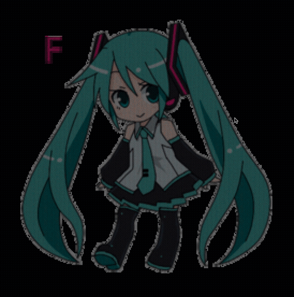
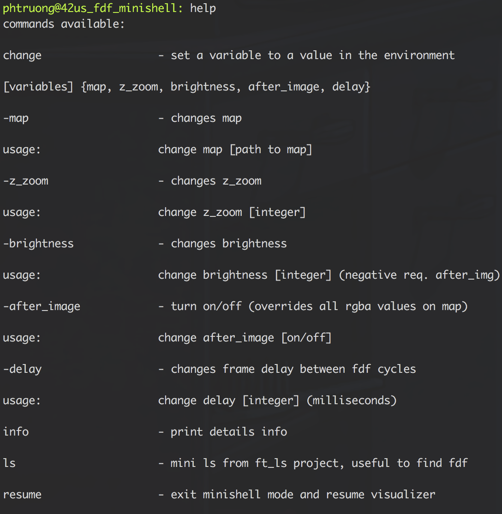
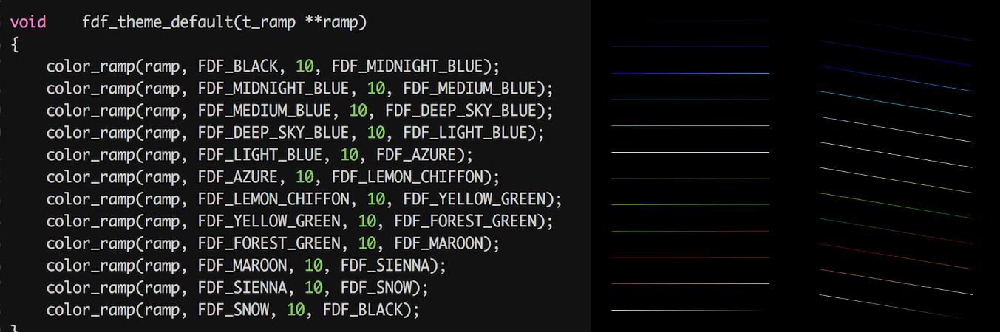
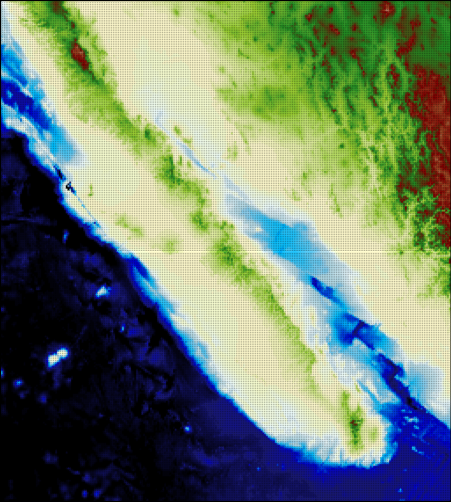
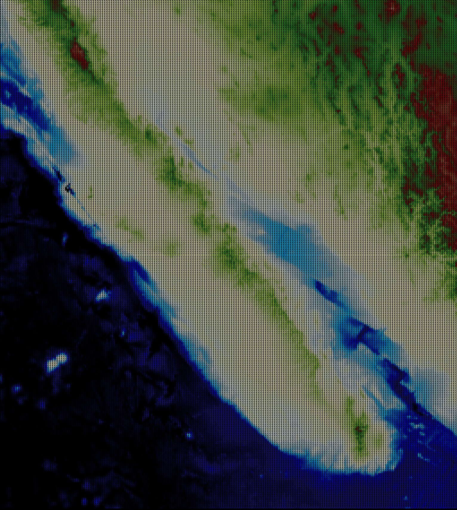
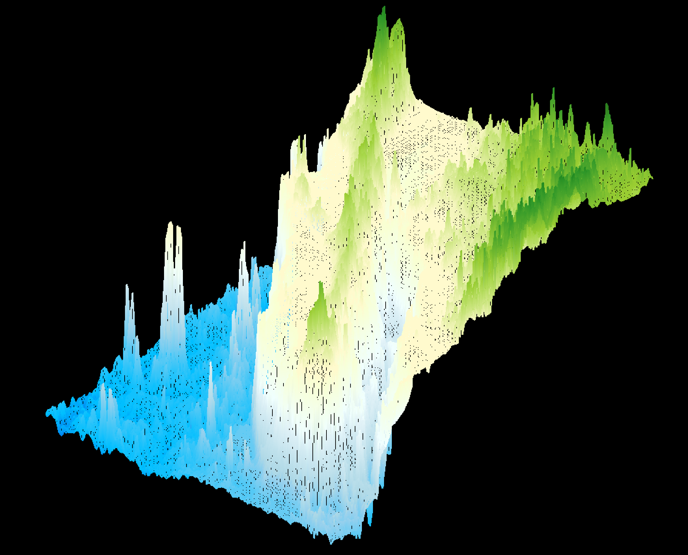
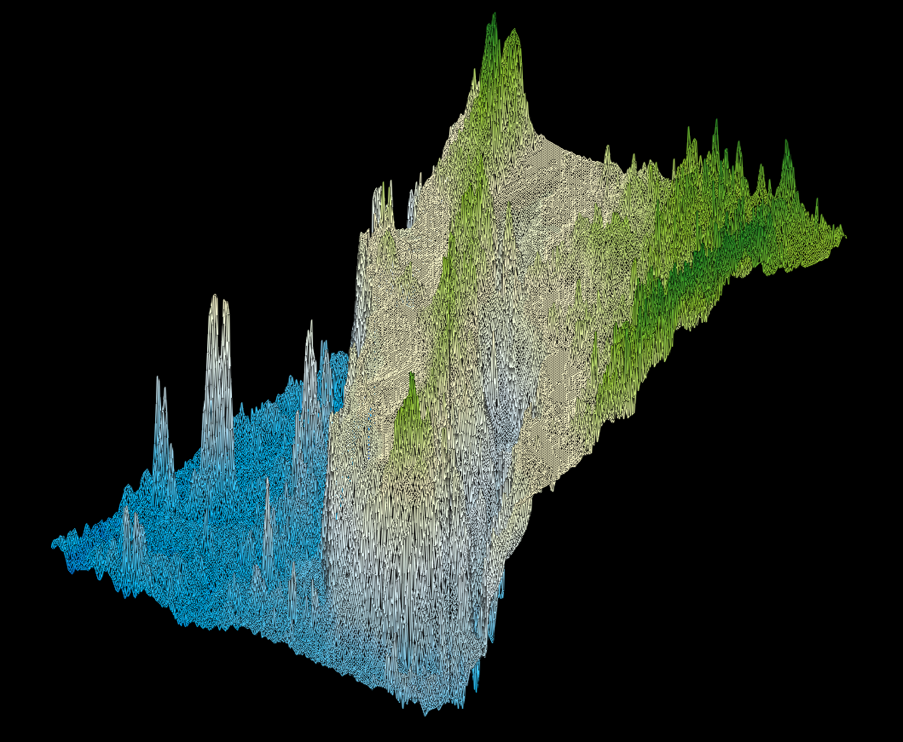

<h1 align="center">42 FDF</h1>
<br>

Many thanks to:
* [Mohammad](https://github.com/mohammadbutt) for helping me out with testing.
* [Vasu aka Jimmy](https://github.com/Zeroays) for helping me make the python script.
* [Vladyslav Brazhnik](https://github.com/VBrazhnik) for his FDF cook book.
* [Tigran Katolikyan](https://github.com/katolikyan) for the depth effect.
* [Mr Colour](https://github.com/mrcolour) for coding advices.
* [Jean-Michel Gigault](https://github.com/jgigault) for his map generator.
* And of course [42 Silicon Valley](https://www.42.us.org) for giving me this opportunity to work on this project.
<p float ="left">
  
  
  <br><br>
</p>

## Table of Content
- [Compatibility](#compatibility)
- [How to run](#how-to-run)
  * [FDF minishell](#fdf-minishell)
- [Gradient](#gradient)
- [Preview](#preview)
- [Gif](#gif)
- [Update Log](#update-log)

### Compatibility

**about this mac**\
iMac (Retina 5K, 27-inch, Late 2015)\
3.2 GHz Intel Core i5\
AMD Radeon R9 M380 2048 MB

**gcc --version**\
Apple LLVM version 9.1.0 (clang-902.0.39.1)\
Target: x86_64-apple-darwin17.5.0\
Thread model: posix

**make --version**\
GNU Make 3.81

Wireframe graphic

### How to run
```
make
./fdf [path to .fdf files]
```
#### fdf minishell
Pressing S will enter shell mode, program will not resume until "resume" command is input
<p align="center">
  
</p>

### Gradient


You can customize your own theme (custom default is black to white)
```c
void fdf_theme_custom(t_ramp **ramp)
{
  color_ramp(ramp, FDF_A, steps, FDF_B); //starting color ramp for FDF_A is for lowest z
  ...
  color_ramp(ramp, FDF_Y, steps, FDF_Z); //ending color ramp for FDF_Z is for highest z
}
```

### Preview

<p align="center">
  <b>Gulf of California Ocean</b><br><br>
  <b>Parallel view:</b><br><br>
  <table border="0" cellpadding="5">
  <tr>
    <td align="center" valign="center">
      
      <br>
      Without anti-aliasing
    </td>
    <td align="center" valign="center">
      
      <br>
      With anti-aliasing
    </td>
   </tr>
   </table>
</p>
<p align="center">
  <b>Isometric view:</b><br><br>
  
  
</p>

### GIF

#### How to make your own fdf gifs
1. Convert a gif to bmp (make sure to give it an easy name before converting)\
I use this [site](https://image.online-convert.com/convert-to-bmp)\
Normally I prefer width around 250 to 300, depending on your program. Just compile with -02 or -03 to make them run faster.
2. Put all the bmp files into a folder and place the bmp folder into the fdf folder
3. Create a new folder to store fdf files
4. Run the the python script like so
```shell
for f in [BMP FOLDER PATH]/*.bmp; do
python3 pixel.py $f [OUTPUT FOLDER PATH]; done
```
5. Rename the files\
When converting gif to bmp, you'd often see something like [prefix]-{0...x}.bmp. To read them in lexicographically order run
```shell
# replace PREFIX with name of your file without numbers at the end
printf '%s\n' *(n) | cat -n | while read n f; do mv $f `printf "[PREFIX]%04d.fdf" $n`; done
# Your files now have 0 paddings.
```
6. Start fdf and run any fdf files
7. Enter shell mode and use animate

You can get results like these:
<details>
   <summary>Game</summary>
   <br>
   <p align ="center">
     <b>Fighting Climax Ignition: Shana</b><br><br>
     <br>
     
   </p>
</details>
<details>
  <summary>Matrix</summary>
  <p align ="center">
  <b>Matrix bullet dodging</b><br><br>
  <br>
  
  </p>
</details>
<details>
  <summary>Isopoly</summary>
  <p align ="center">
  <b>Isopoly for "3D"</b><br><br>
  <br>
  
  </p>
</details>
If you find program runs too fast, you can increase the resolution of the bmp(make new ones) or add in a delay function.

```c
// Something like this
void	delay(int milliseconds)
{
	unsigned long	pause;
	clock_t			now;
	clock_t			then;

	pause = milliseconds * (CLOCKS_PER_SEC / 1000);
	then = clock();
	now = then;
	while ((now - then) < pause)
		now = clock();
}
```

#### Update Log
<details><summary>September</summary><br>
  <b>09/06/2019</b><br><br>
  
  + Code
    + Fixed minor math issue and increase brightness by 20% for anti alias
  + Image assets
    + Added better resolution pictures for comparison between AA and normal
    + Added pictures for minishell
  + Extra
    + Update shell_help.txt
    + Added explanation for gifs
    + Added explanation for how to run
 
<b>09/05/2019</b><br>

  + Code
    + Change algorithm to use int instead of doubles.
    + Added rosetta code algo for comparison.
    + Added functionality for alias.
  + Image assets
    + Fix resolution after adding anti alias
    + Update better gifs for matrix
    + Gifs are now collapsible
    
</details>
