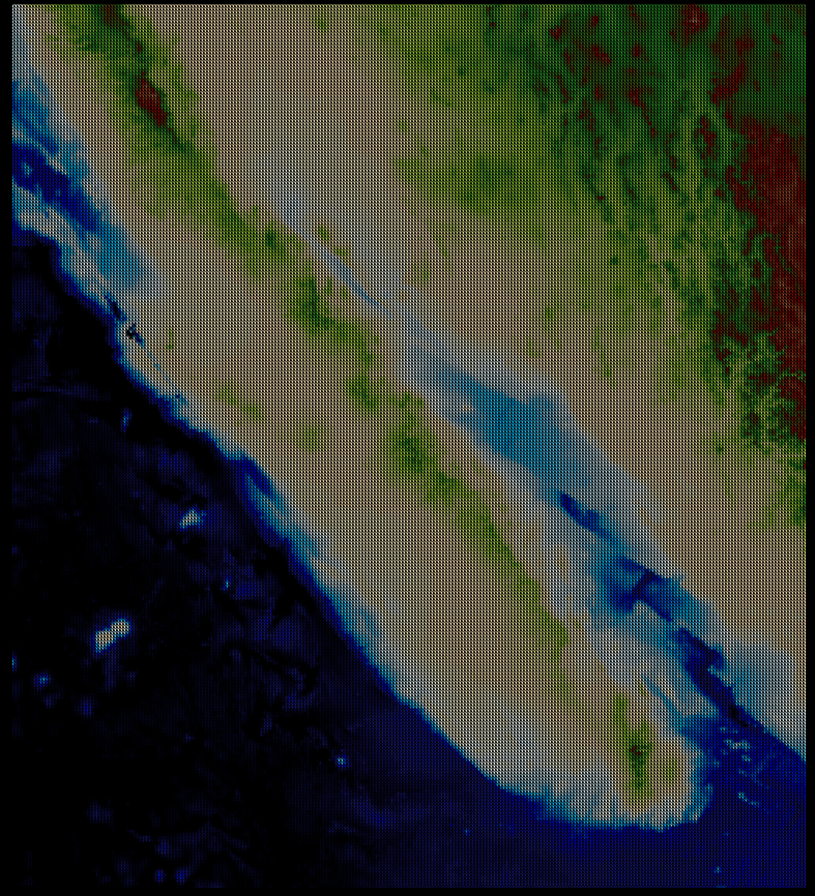
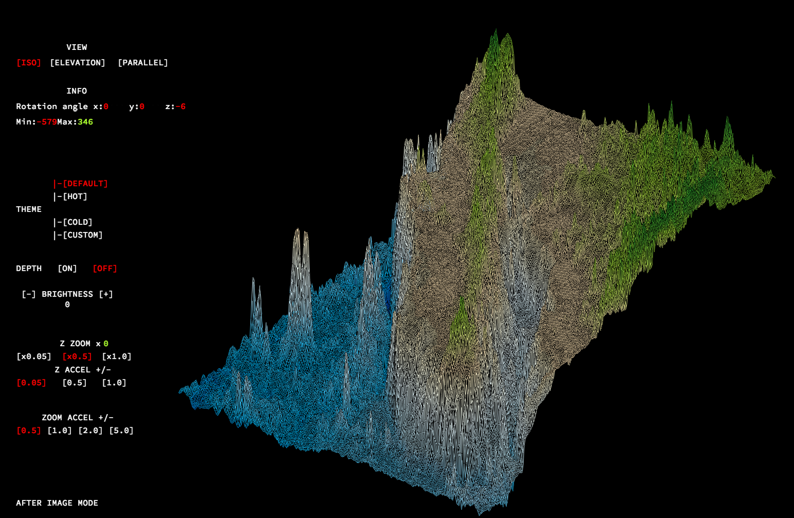

# 42_fdf
___
<p float ="left">
  
  
  <br><br>
</p>

## Compatibility (only tested with school machine):

**about this mac**\
iMac (Retina 5K, 27-inch, Late 2015)\
3.2 GHz Intel Core i5\
AMD Radeon R9 M380 2048 MB

**gcc --version**\
Apple LLVM version 9.1.0 (clang-902.0.39.1)\
Target: x86_64-apple-darwin17.5.0\
Thread model: posix

**make --version**\
GNU Make 3.81

Wireframe graphic

How to run
```
make
./fdf [path to .fdf files]
```

### Gradient

Theme demo:


<p align="center">
  <b>Gulf of California Ocean</b><br><br>
  <b>Parallel view:</b><br><br>
  
  <br><br>
  <b>Isometric view:</b><br><br>
  
</p>

### GIF demonstration
<p align="center">
  <b>Fighting Climax Ignition: Shana</b><br><br>
  <br>
  <b>fdf files parsed with 160 x 90</b><br>
  
  <br><br>
  <b>Matrix famous scene</b><br><br>
  <br>
  <b>fdf files parsed with 120 x 49</b><br>
  
  <br><br>
  <b>Isopoly for "3D"</b><br><br>
  <br>
  <b>fdf files parsed with 128 x 128</b><br>
  
</p>
