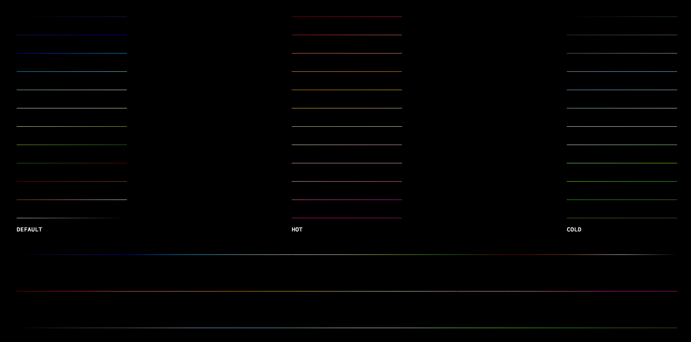

# 42_fdf


\
\
## Compatibility (only tested with school machine):

**about this mac**\
iMac (Retina 5K, 27-inch, Late 2015)\
3.2 GHz Intel Core i5\
AMD Radeon R9 M380 2048 MB

**gcc --version**\
Apple LLVM version 9.1.0 (clang-902.0.39.1)\
Target: x86_64-apple-darwin17.5.0\
Thread model: posix

**make --version**\
GNU Make 3.81

Wireframe graphic

How to run
```
make
./fdf [path to .fdf files]
```

### Gradient

Theme demo:

Gulf of California, ocean:


\
### GIF demonstration
<p align="center">
  
</p>
<p align="center">
  
</p>
<p align="center">
  
</p>
<p align="center">
  
</p>
